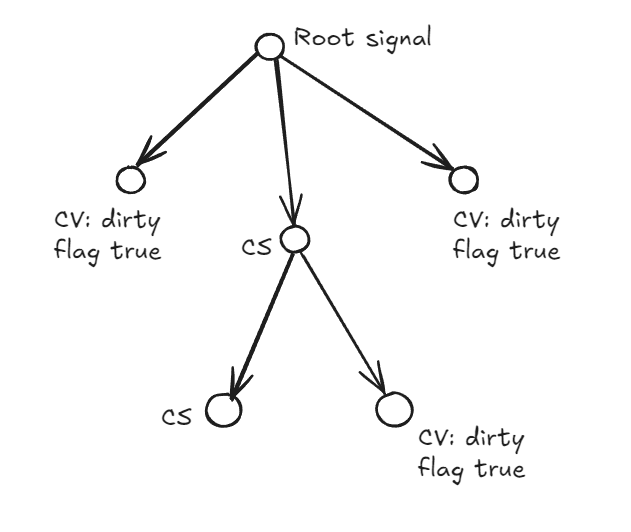

# MyWayToGolang
Here I will record my small exercises while learning Go. Why not making it public?
Below I will list everything I do and what I learned/was cool to me.

## 1. SumNumbersWithCalcHistory

Small calculator that sums up 2 numbers and register them in a history that can be requested at anytime or at the end of the program.

- Throwback to C/C++ with little pointer operations (Scanf, custom parser that return an integer or a string ptr error)
- After reading some theory of slices and how they work under the hood I implemented a history of my sums operations
- Goofed around the go libraries, I was able to convert string to Numbers, trim strings and add an element at index 0 with the slices package util!
- for loops ranges, for based on a boolean (a while but not a while lol) and some other basic things 

## 2. CatchTheBall

Small game in which there are 5 cups and a ball inside, two players can challenger each others, additionally there is player vs bot, and funny enough bot vs bol lol

- Learned a concise way to do input validation in loop until conditions are satisfied with a for loop
> ```for readStdinTrim(&input); !isValidChoice(input); readStdinTrim(&input) {}```
- Used for the first time structs data type, nested structs. Kinda simple
- Associated some "methods" or rather functions to a struct, they are called Pointer receivers and are similar to how Extensions are used in C#. You can associate functions to a specific type of struct/*struct.
- Having a reference to a function is super easy, just create a variable with func(any,type,in,input)output. I used those to make a game based on events separating input/console prints from game logic.

## 3. JsonParser

Started out as a tokenizer for Json but eventually I wanted to create a full parser which is more useful in the real word so I did it. I had already created this kind of things by creating a interpeter for a language of mine (in OCaml and Python), <i>I wanted to test this against the built-in solution provided by Golang but benchmarks + pprof made me so angry that I ragequitted, everytime I run the same exact command I would get different mem allocated and a totally different list of instruction that allocated the memory with same input!!</i> That's insane I will get back to it another time, and anyway, I run the comparison anyway and the results were not that different, use my impl :P (<b>joking don't</b>).

I came out with a syntax along this way, chars are described in doublequotes, multiword token are described without dquotes, in <> the non terminal symbols:
```
PARSER RESULT: <output_value>
<output_value> ::= <object> | <array>
<array> ::= "[" "]" | "[" <elements> "]"
<elements> ::= <all_values> | <elements> "," <all_values>
<all_values> ::= true | false | null | NUMBER | TEXT | <output_value>
<object> ::= "{" "}" | "{" <properties> "}" OK
<properties> ::= <property> | <properties> "," <property> OK
<property> ::= TEXT ":" <all_values> OK
```

- I got familiar with type "aliasing" which came up handy when trying to replicate an enum in Golang since I wanted to be able to describe the tokens with a finite typed elements. This came with a bit of a headache because it's not literally an aliasing, I'm creating a new type which is not the same of the one I started with. I can't assign one to another so I had to do sometime a <b>triple conversion</b> :^).
    - I decided to use primarly rune because it's perfect for all kinds of operations since a lot of the buil-in stuff work well with it, byte is a bit too... <i>primitive</i>.
    ```go
    type TokenType rune

    const (
        CURLY_OPEN   = TokenType('{')
        CURLY_CLOSE  = TokenType('}')
        SQUARE_OPEN  = TokenType('[')
        SQUARE_CLOSE = TokenType(']')
        DOUBLEQUOTE  = TokenType('"')
        SPACE        = TokenType(' ')
        TAB          = TokenType('\t')
        COLON        = TokenType(':')
        COMMA        = TokenType(',')
        BACKINLINE   = TokenType('\n')
        TRUE         = TokenType(0) // this is a multicharacter word, setting a placeholder
        FALSE        = TokenType(1)
        NULL         = TokenType(2)
        NUMBER       = TokenType(3)
        TEXT         = TokenType(4)
    )
    ...

    for i := 0; i < strLen; i++ {
            isEOF := false
            c := rune(str[i]) // convert byte to rune

            switch TokenType(c) { // convert rune to ttype
            case SPACE, TAB, BACKINLINE:
                ...
    ```
- Beside the randomness that the ```benchmark + pprof``` <i>inflicted</i> to me, I learned a lot of useful commands, <u>benchmark for memories</u>, <u>for cpu</u>, <u>N iterations</u>, <u>initialization of a test + Reset of timers</u>, <u>output a benchmark file to be opened in pprof and all kinds of visualizations for cpu/memory profiling</u>
- I'm not sure how to put it, <i>I hate Golang error managment</i>, no.. not that much, I appreciate the fact that Golang is making the code more easy to follow with a slow and line by line approach instead of having some magic bs but depending on what are you creating this gets super annoying.<br/>
Mine is a Parser right? Supposing I'm making a library out of it and I want to notify the caller the response and the eventual error, I would setup my "interface" like this (it's done like that in the code too):
    ```go
    func JsonStringToMap(input string) (any, error)
    ```
    Considering I'm making it recursive so I can parse the tokens in easier way I created 4 other helper function that are there to parse 4 non terminal symbols from the table above:
    ```
    <array> ::= "[" "]" | "[" <elements> "]"
    <all_values> ::= true | false | null | NUMBER | TEXT | <output_value>
    <object> ::= "{" "}" | "{" <properties> "}"
    <property> ::= TEXT ":" <all_values>
    ```
    which then they will have the same pattern as the parent
    ```go
    func jsonValue(fromIndex int, tokens []Token) (any, int, error) // all_values
    func parseJsonProperty(fromIndex int, tokens []Token) (string, any, int, error)
    func parseJsonObject(fromIndex int, tokens []Token) (map[string]any, int, error)
    func parseJsonArray(fromIndex int, tokens []Token) ([]any, int, error)
    ```
    Notice they have error in all functions? Some needs to check about for those errors and return them in cascade until they reach the initial caller, so the code becomes a huge amount of assignment, error check and return of the error. This for almost every 5 lines of code, doensn't sound exciting to me:
    ```go
    //example
    func parseJsonProperty(fromIndex int, tokens []Token) (string, any, int, error) {
        key := ""
        var value any = nil

        isType, err := isTokenTypeAt(TEXT, fromIndex, tokens)
        if err != nil {
            return key, value, fromIndex, err
        }
        if !isType {
            return key, value, fromIndex, fmt.Errorf("parsing error expected key at index: %d", tokens[fromIndex].startAt)
        }
        key = tokens[fromIndex].value
        fromIndex += 1

        isType, err = isTokenTypeAt(COLON, fromIndex, tokens)
        if err != nil {
            return key, value, fromIndex, err
        }
        if !isType {
            return key, value, fromIndex, fmt.Errorf("parsing error missing colon at index: %d", tokens[fromIndex].startAt)
        }
        fromIndex += 1

        valueToken := nextToken(fromIndex, tokens)
        if valueToken == nil {
            return key, value, fromIndex, fmt.Errorf("parsing error property value not defined at index: %d", tokens[fromIndex-1].startAt)
        }

        value, fromIndex, err = jsonValue(fromIndex, tokens)
        return key, value, fromIndex, err
    }
    ```
    I was so desperate about C Macros in Go, Imagine being able to do
    ```c
    #define RETURN_ON_ERROR(isType, err, msgError, ...) \
        if err != nil { \
            return key, value, fromIndex, err \
        } \
        if !isType { \
            return key, value, fromIndex, fmt.Errorf(msgError, __VA_ARGS__) \
        }

    ```
    and then use it like this:
    ```go
    func parseJsonProperty(fromIndex int, tokens []Token) (string, any, int, error) {
        key := ""
        var value any = nil

        isType, err := isTokenTypeAt(TEXT, fromIndex, tokens)
        RETURN_ON_ERROR(isType, err, "parsing error expected key at index: %d", tokens[fromIndex].startAt)
        key = tokens[fromIndex].value
        fromIndex += 1

        isType, err = isTokenTypeAt(COLON, fromIndex, tokens)
        RETURN_ON_ERROR(isType, err, "parsing error missing colon at index: %d", tokens[fromIndex].startAt)
        fromIndex += 1

        valueToken := nextToken(fromIndex, tokens)
        RETURN_ON_ERROR(valueToken != nil, err, "parsing error property value not defined at index: %d", tokens[fromIndex].startAt)
        value, fromIndex, err = jsonValue(fromIndex, tokens)
        return key, value, fromIndex, err
    }
    ```
    Forget the probably inexact syntax, I'm not sure if It would have been better with macros, probably 90% of you are cursing me but I find they perfect for Golang repetitive error handling.
- Learned how to make subfolders to organize the code, it was really a <i>painful disaster</i>, I thought each folder had to have it's own module, combine it with the fact that VSCode with the Golang plugin often stop to load intellisense It became a <b>trial and error war</b>. Lucky enough I found a resource online which illuminated me, I didn't have to make one module for each folder, I just needed one at the root level and import ```rootlevelmodule/subfoldername```...
- I used a linear loop approach for the Tokenizer and a recursive one for the Parser, it felt natural for the more complex organization a Parser and all the tokens it has to put together. Tokenizers don't have much logic and kinda divide things in tokens linearly one by one.
- Small mention to ```fmt.Errorf```, I was always using ```errors.New + fmt.Sprintf``` to format an error and return the actual error. That function do both with a single line!
- Woa 90% rants 10% content 

## 4. Signals

Signals are a way to notify all listeners to a specific signal by broadcasting the updated value. In short there will be a writer that uses the .Set method, and a number of listeners that provide a callback and wait to be called when the data changes.
This was a very interesting project, not only about all kinds of topics that came up but also because I took inspiration from a Javascript Proposal which is currently in Stage 1 that wants to bring to js a standarized impl of Signals (github: [JS Proposal](https://github.com/tc39/proposal-signals)). Moreover in my opinion Golang it's a bit boring as a language, the plain error handling, everything is boring and sequential. I think it's a good thing, everything needs to be handled in a linear order being too creative, it works.
Having said that I made the language a bit more crazy by creating Signals which relies a lot on FP since listeners will be notified via callback they provide and everything work magically.
There are 3 main types in this lib:
- Signal
- ComputedSignal
- ComputedValue

#### They serve different purpose:
- Signals: They have a state that can be changed via .Set and can be read with .Get, moreover you can listen to data changes in async or sync mode.
- ComputedSignal: Similar to Signals but without the possibility to .Set the value, this because while creating this object a map func must be provided and when the internal flag is dirty, the value is recalculated based on that map function. Also this type accept listeners to check for data updates.
- ComputedValue: We talked about signals up until now but.. this is not a signal! Similarly to ComputedSignal this does not hold a value but a map func and during the .Get the value is recalculated and returned to the client. Since this is not a signal there are no listeners, when this computed value change you cannot listen for changes, but the value will be returned with .Get lazily.

Mind that the map functions are not recalculated everytime, or at least not always.

#### How do we know if ComputedSignal/Value needs to be recalculated?
These values are recalculate only when needed, since these two types works with two different modes we expect different results:
- ComputedSignal: the value is always recalculated everytime that another signal that this depends on changes, so everytime something changes this needs to recalculate the value because there are listeners that wait for a notification, it's unavoidable.. BUT: it's calculated only once, so future .Get will return the same cached values.
- ComputedValue: since these are not signals and don't need to satisfy any clients that needs a callback update, these are lazy loaded data, the internal flag is marker as dirty when some signals this depends on changes, It will not recalculate the value until someone calls .Get.

#### How does it work under the hood for tracking "dirty flags"?
Lets start by saying there kinda is a hierarchy Signal > Computed Signal > Computed Value.

This because a Signal has a state that can be set and can be a dependency for Computed Signals and Computed Values.</br>
At the same time Computed Signal can be a dependency for Computed Value but the opposive way is not true.

So we have a flow that goes from Signal to ComputedValue creating a N tree structure. This goes for each signal, each signal has it's own dependencies and it's own structure.

Everytime the signal data is .Set it go through all dependencies and:
- ask ComputedValues to set their dirty flag as true OR ask ComputedSignals to update their internal values since the parent changed and recursively repeat for their dependencies.
- Trigger the listeners async and sync altogether
- When finished, the signal itself updated everyone and all the tree has been updated with dirty flags and new calculated values we ask recursively to ComputedSignals to notify their listeners aswell.

So at the end of this process Signals and ComputedSignals will have everyone updated, meanwhile ComputedValues will have their flag dirty as true and waiting for someone to .Get to recalculated the new value.


This project is aiming of being used aync or sync without major problems, the concurrency has been dealt with mutex and rwmutex.

#### Limitations
When declaring a ComputedSig/Val we must state which other signals/computed signals we depends on, which is fine since also React JS does that with useEffect, but It would have been way nicer if the Golang could detected which signal was used inside the map func and automatically fill it for us. Having said that sometime using it manually it's a must, for example if we want to do something when a signal value change without actually using that signal, or we want to use that signal value but without depending on it but another signal. So I think doing it manually is more then fine since we have more control.

Care about deadlocks! You can't se the value of the signals tree we were called from because 1) it's under a mutex so the main signal is waiting for everyone to finish but a dependency signal is asking to .Set a value but it's stuck since the mutex is locked and will not be freed. 2) Even without this locking mechaism most likely we will get a stackoverflow due to the recursively data change from child to parent and so one since it will trigger the procedure to set dirty flags, recalc value and trigger listeners.

Those on top were not much of limitations but generally best pratices on coding, the main limitations for this is:
- For Signals/Computed Signals only comparable type are allowed which sucks a bit, otherwise we could not check if a value .Set or recalculated value is equal to the previous one. Unfortunately this limit a bit what we can do, for example no custom structs and no slices, map and so on. [I didn't set this costraint on ComputedValues since they cant be used as dependencies]

I think to bypass this problem we could create custom signals type? It would required a lot of code tho..

What I learned:
- I was forced to use interfaces, not only that but to use more then one I think I needed! This because what I can accomplish with generics is limited in Go, I couldn't create a parametrized method using a new generic variable[X] inside a parametrized interface[Y].
But adapting myself to Go I was able to have a less complex structure in favor of small interfaces used for different purposes.
- Asynchronous operation with Go coroutines were a piece of cakes, don't get me wrong I didn't that crazy logic to do nevertheless it was very linear and clean. I also used a bit of mutex, this is kinda the same for every language so nothing more here. I didn't use channels since I didn't need any return from those routines but they look pretty good and easy to use.
- I learned a good way (I hope so) to have unique IDs for listeners callbacks. Why not use the pointer function itself? But what if we want the same function used in two different listeners and being able to remove only one of them? So I introduced a new type which is just a wrapper over a func of the expected type
```go
type ListenerEvent[T comparable] func(T, *BaseSignal[T])
```

```go
event1 := ListenerEvent[T](whateverFn)
event2 := ListenerEvent[T](whateverFn)
```

This was the only way, a pointer function doesn't change, but if we wrap it around a new object we obtain a new pointer each time.


